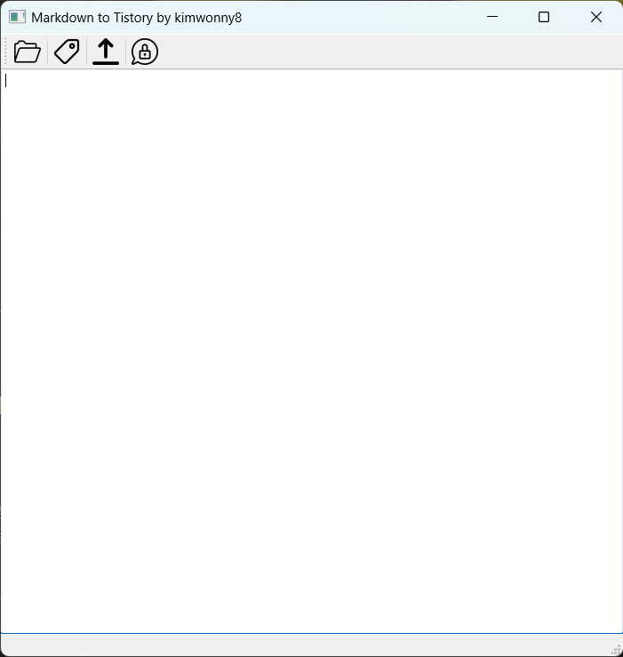

# Markdown-Tistory

마크다운 문서를 티스토리 블로그에 자동 업로드 해주는 프로그램입니다.

마크다운으로 문서를 주로 작성하는 사람들에게 블로그 업로드를 좀 더 편하게 할 수 있게 만들었습니다.

HTML 문법이 섞여있지 않는, 순수 마크다운 문서만 지원합니다. 


<br>


## 📌 파일 다운로드

dist 폴더를 다운 받아 `tistory.json` 에 아래와 같이 입력 후 `M2T.exe` 프로그램을 실행하세요.

`img` 폴더와 `tistory.json`은 `M2T.exe` 파일과 같은 폴더에 있어야합니다!

<br>


## 📌 블로그 기본정보 등록 `tistory.json`

본인의 Tistory 정보를 `tistory.json` 폴더에 아래와 같은 형태로 작성해주세요.

tistory api를 사용해본적이 없으시다면 아래의 블로그를 참고해 1~3번까지 진행해주세요!

https://kimwonny.tistory.com/106


access token 은 프로그램 실행시 자동으로 등록됩니다.

```json
{
	"client_id": "",
	"client_secret": "",
	"code": "",
	"redirect_uri": "",
	"blogName": ""
}
```


<br>


## 📌 파일 추가


- 위 아이콘을 클릭 시 업로드할 파일을 추가할 수 있습니다.
- 텍스트로 변환이 되는 파일 형식이라면 모두 업로드가 가능하지만 내용이 깨지므로 md만 권장합니다.

<br>


## 📌 카테고리

- 파일의 제목이 작성될 글이 되고, 그 파일이 담고 있는 폴더가 카테고리로 정해집니다.

- 예를 들어, `D:\project\TIL\프로그래밍\Python\제목입니다.md` 라는 파일이 있다면

​		카테고리는 `Python`으로 결정되고, 제목은 `제목입니다` 가 됩니다.

- 현재 블로그에 없는 카테고리라면 없는 상태로 업로드 할 수 있습니다.

<br>


## 📌업로드

### 공개 업로드


- 공개 업로드 아이콘 입니다.
- 블로그 업로드시 공개로 업로드됩니다.

<br>

### 비공개 업로드


- 비공개 업로드 아이콘 입니다.
- 블로그 업로드시 비공개로 업로드됩니다.

<br>


## 📌 태그


- 파일 추가버튼 옆에 태그 버튼이 있습니다.

- 한 줄 단위로 태그를 입력 후 추가하면 태그가 추가됩니다.

​	예를 들어, `Python`, `Pyqt5`, `파일 열기` 인 태그를 등록하고 싶으면 

```
    Python
    Pyqt5
    파일 열기
```

​	순으로 입력 후 진행하시면 됩니다!

- 동일한 태그 입력시 하나만 추가됩니다.
- 빈 칸 입력시 추가되지 않습니다.

<br>

***


## 👩‍💻 Version

`v1.0.0 : 20230214`

- 자동 업로드 기능
- 비공개/공개 선택
- 카테고리 자동 선택
- pyinstaller 

<br>


`v1.1.0 : 20230215`

- 태그 기능 추가
- `tistory.json` 에 내용 없을 시 오류 수정

<br>

`v1.1.1 : 20230220`

- 태그 없을 시 생기는 오류 수정
